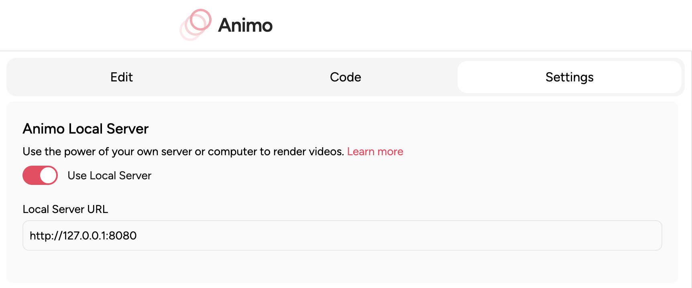

# 🔬 Generative Manim API (Animation Processing Interface)

The Animation Processing Interface or API is a REST API that can be used to generate Manim scripts using LLMs and render videos from Python code. This is the API used on [Generative Manim Demo](https://generative-manim.vercel.app/) and [Animo](https://animo.video) under the hood.

## 🚀 Concept

We are creating the software that enables you to transform ideas, concepts, and more into animated videos.

Generative Manim API (Animation Processing Interface) empowers you to generate Manim scripts using LLMs and render videos from Python code. This allows seamless integration into your website, app, or any kind of project that requires animations. Happy coding!

## 🤖 Animo

[Animo](https://animo.video) allows you to use this API as your own Animation Processing Interface. That way, you can have more control and flexibility over the animations you generate. To connect to your own server from Animo, set up this server, and enable **Use Local Server** in the **Settings** tab of your Animo project.



## 📦 Installation

### Prerequisites

Altough Docker is not required, it is recommended to make sure you have the necessary tools to render videos or to generate code.

- [Docker](https://www.docker.com/)
- [Docker Compose](https://docs.docker.com/compose/)
- [Manim](https://docs.manim.community/en/stable/installation.html)

And, depending on the model you want to use, you will need to have an API key for the model provider.

- [OpenAI](https://openai.com/api/)
- [Anthropic](https://www.anthropic.com/api)

If you are on MacOS, make sure you have `pkg-config` and `cairo` installed. You can install them using Homebrew:

```bash
brew install pkg-config
brew install cairo
```

### Steps

1. **Clone the repository:**

```bash
git clone https://github.com/360macky/generative-manim.git
```

2. **Install the requirements on the `/api` directory:**

```bash
cd api
pip install -r requirements.txt
```

Now you have the option of running the API locally or using Docker.

### Running the API locally

3. Run the `run.py` script to start the API server.

```bash
cd generative-manim
python run.py
```

### Running the API using Docker

3. **Build the Docker image:**

```bash
docker build -t generative-manim-api .

```

3. **Run the Docker container:**

```bash
docker run -p 8080:8080 generative-manim-api
```

4. **Wohoo!** 🎉 Congratulations! You have the API running.

Now that you have the API running, you can use it to generate Manim scripts and render videos. Or you can interact with it using the [Animo](https://animo.video) platform. Remember to enable **Use Local Server** in the **Settings** tab of your Animo project. And when required, paste the HTTP URL to the API.

## 🍓 Usage

### 💻 How to generate Manim Code?

Let's say you want to create a simple animation that shows a square transforming into a circle. You can use the `/v1/code/generation` endpoint with a POST request. Like this:

```bash
curl -X POST http://127.0.0.1:8080/v1/code/generation \
-H "Content-Type: application/json" \
-d '{
  "prompt": "Create a Manim animation that shows a square transforming into a circle"
}'
```

### 💬 How to generate Manim Code via chat?

Let's say you want to generate a simple animation of a 3D rotating cube. You can use the `/v1/chat/generation` endpoint with a POST request. Like this:

```bash
curl -N -X POST http://127.0.0.1:8080/v1/chat/generation \
-H "Content-Type: application/json" \
-d '{
  "messages": [
    {
      "role": "user",
      "content": "Create a simple Manim animation that shows a circle transforming into a square."
    }
  ],
  "engine": "anthropic"
}'
```

When executed, the API will return the stream of the latest assistant message.

### 🎥 How to render a Manim video?

Let's say you want to render a circle scaling animation. You can use the `/v1/video/rendering` endpoint with a POST request. Like this:

```bash
curl -X POST http://127.0.0.1:8080/v1/video/rendering \
-H "Content-Type: application/json" \
-d '{
  "code": "from manim import *\n\nclass DrawCircle(Scene):\n    def construct(self):\n        # Create a circle object\n        circle = Circle()\n\n        # Use the animate API to smoothly scale the circle down to a radius of 0.1\n        self.play(Create(circle))\n",
  "file_name": "scene_56861",
  "file_class": "DrawCircle",
  "stream": true
}'
```
